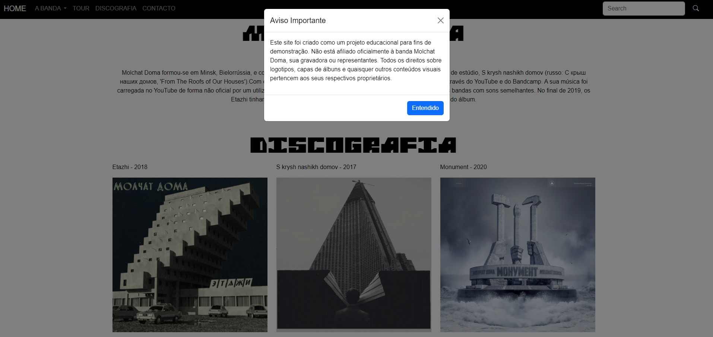

# Molchat Doma Fan Site - Projeto Educacional



Este é um projeto fictício criado como parte de um curso de desenvolvimento web. Trata-se de um site para a banda Molchat Doma, desenvolvido para demonstrar competências em HTML, CSS, Bootstrap e JavaScript. **Não possui qualquer afiliação oficial com a banda, gravadora ou representantes.**

> **Aviso**: Este projeto é exclusivamente para fins de demonstração e aprendizagem. Todos os direitos sobre logótipos, capas de álbuns e outros conteúdos pertencem aos seus respetivos proprietários.

## Funcionalidades

- **Página inicial** com informações fictícias sobre a banda.  
- **Galeria** de capas de álbuns estilizada.  
- **Modal de aviso** exibido ao carregar o site, informando sobre o propósito educacional do projeto.  
- Design responsivo utilizando **Bootstrap**.

## Tecnologias Utilizadas

- **HTML5** - Estrutura do site.  
- **CSS3** - Estilização personalizada.  
- **Bootstrap** - Framework para estilização e responsividade.  
- **JavaScript** - Scripts básicos, incluindo o modal inicial.

## Como Visualizar o Projeto

Clone o repositório:
```bash
git clone https://github.com/AndreGomes-pt/molchatdoma
   ``` 
 ### 2. Navegue até ao diretório do projeto:
   ```bash
   cd molchatdoma
   ```
 ### 3. Abra o ficheiro index.html no navegador.
 Ou aceda ao projeto publicado diretamente através do GitHub Pages: [Molchat Doma](https://andregomes-pt.github.io/molchatdoma/)

